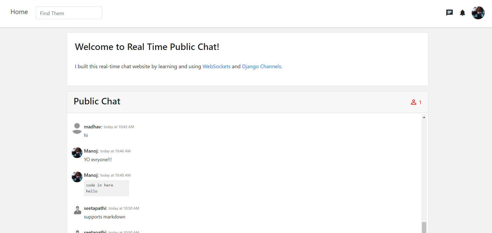
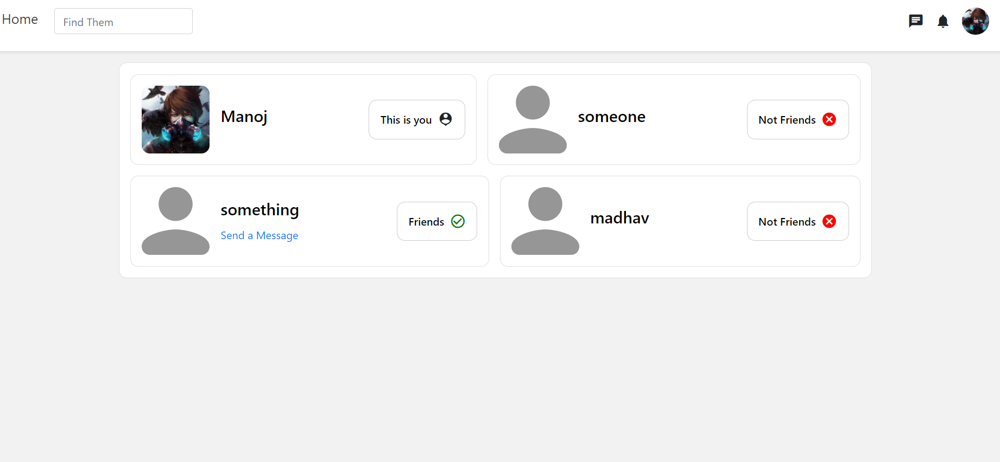
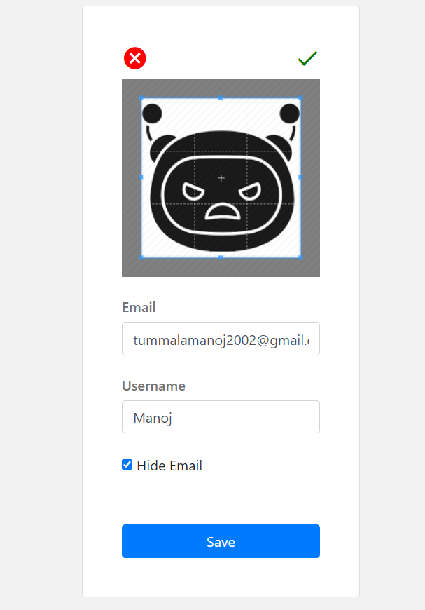
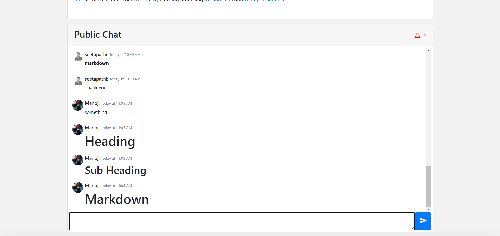

# Real-Time-Chat-Application-using-WebSockets-and-DjangoChannels
Its is a real time public chat website using python Django framework, Django channels and web sockets

**Only authorized users can chat after they login**

*During login, I didnt add the feature of captcha just cause I didnt want to, but added other extra features.*

*The homepage shows the public chat which is similar to the group chat and display details of the user texting and relative time of the message*

*The message even contains the username from which it was sent and by clicking on it, it will take us to his acccount.*

*once if an authorized user is logged in and starts using the public chat then the couter showing the users online in the right corner will increase.*

*Any authorized user can check for other users by searhcing the user's name in the serch bar and ther eby can view his account.*
*But an unauthorized user when searching for other users can only see the basic account information(cannot see his/her frinds and other).*

*Any authorized user can send and recieve and cancel any friend request he gets or sends, and even can unfriends other users.*

*He can customize his acount- like changing his saved email id (or) he can even hide his email id from other(included option) and can change passwords,
and can change his profile picture as he wants by even cropping it.*

*The public chat also supports markdown and if you want to send a code then you can just type it with syntax in markdown and you can view the message
being highlighted with respective language syntax.*

***Further improvements to be made in future :***

- *including private chat*

- *including notifications(to get a notification of any even occured relating to the user, 
like accepted friend request, unfriended by other user, other.*

- *including message notifications(to get a message notification if he got a msg in personal chat)*

- *publishing it and making it accessible as a real website*

- *If possible, making a android application*
